# 网页测试

测试网站的网址: [https://test.orangex4.workers.dev/](https://test.orangex4.workers.dev/)

你们可以打开试试.

我们可以现在这里进行 HTML, CSS, JS 的测试和学习.

在更改一部分网站内容之后, 如果你想展示给我们看, 就可以提交你的代码, 等待几分钟, 网站的内容就会被更改, 我们就可以观看你写的内容了.

## 初始化项目

1. 点击 Watch

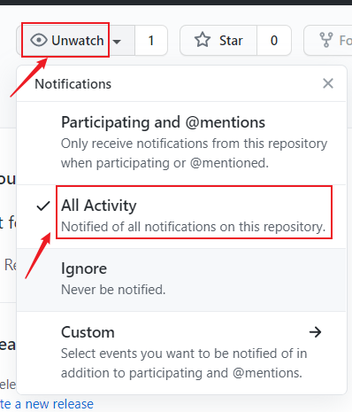

2. Clone 到本地

在你存放代码的目录下, 使用命令行命令:

``` sh
git clone git@github.com:No-Code-No-Life-in-EL/Web-Test.git
cd Web-Test
```

3. 用 VSCode 打开这个目录

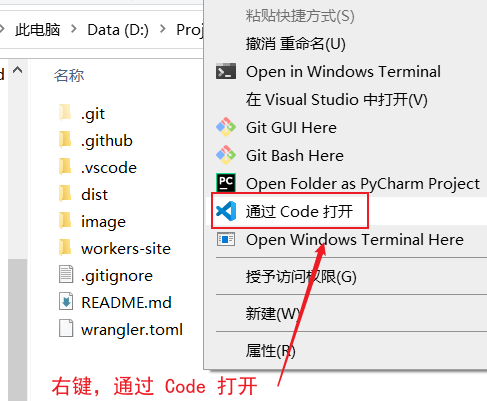

4. 展开 `dist` 文件夹
 
`dist` 是存放代码的文件夹, 其他文件夹和文件可以先不用在意.

如果 VSCode 提示你安装插件, 点安装就行了.

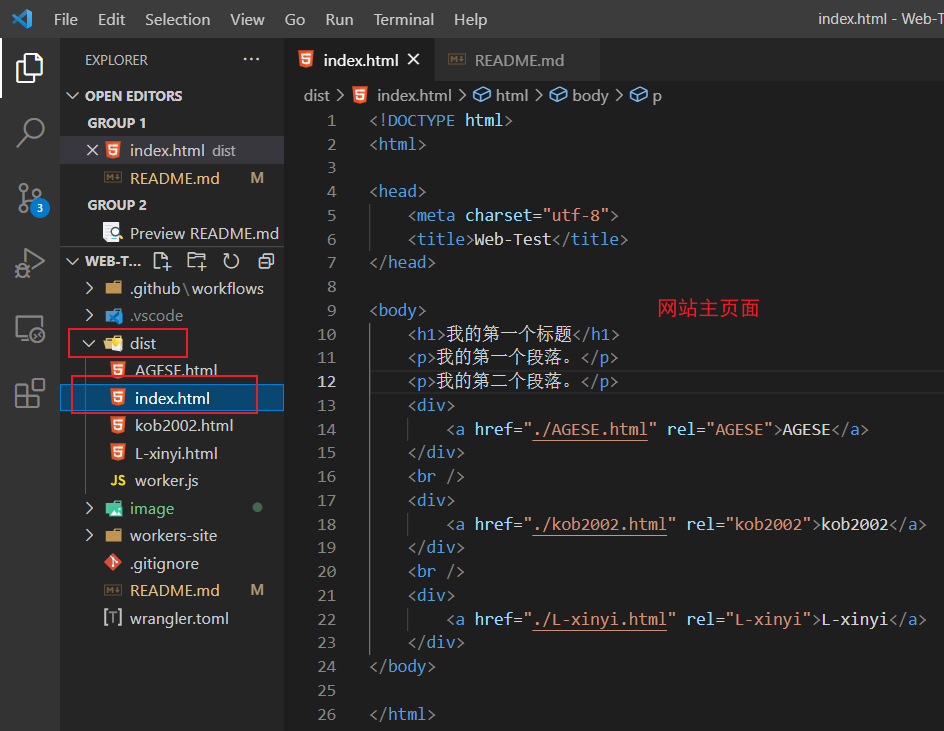

5. 安装 Git Lens 插件

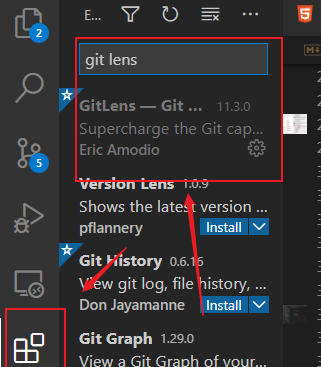

## 更改与提交

1. 在开始你的工作之前, 请先使用一次 Git Pull, 拉取他人增加的内容.

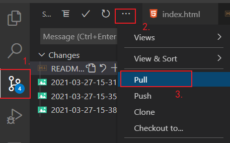

2. 增加你想加入的内容.

在你们自己的 HTML 文件中, 加入或更改内容, 如 `kob2002.html`.

绿色表示增加的内容, 蓝色表示更改的内容.

按下快捷键 `Shift + Alt + F` 可以规整代码.

请在每一次提交前都使用一次这个快捷键整理代码.

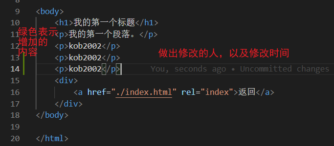

3. 提交之前, 先用 Live Server 插件跑一下试试.

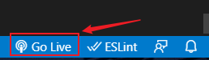

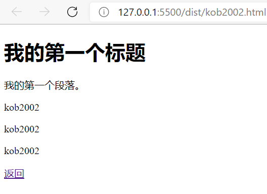

4. 确认无误后, 就进行 Git Commit.

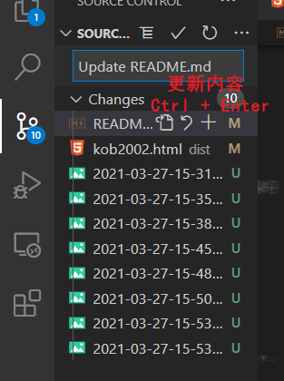

5. 在提交上 GitHub 前, 请再一次 Git Pull.


6. 最后, 进行 Git Push, 推送到 GitHub.

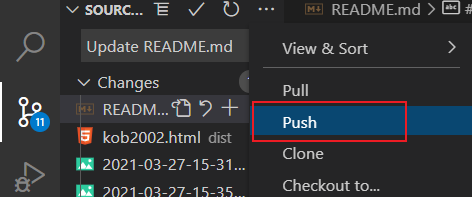

7. 静待一两分钟, 等待 GitHub Action 执行完毕.

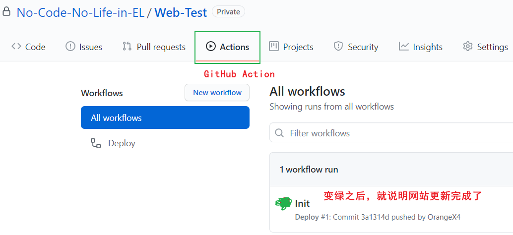

8. 最后打开[网站](https://test.orangex4.workers.dev/), 应该就发生改变了.

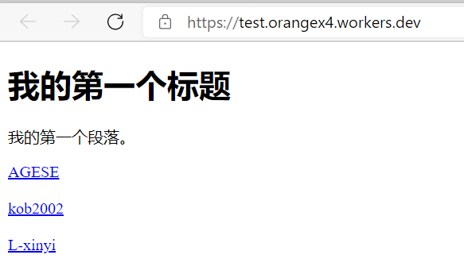